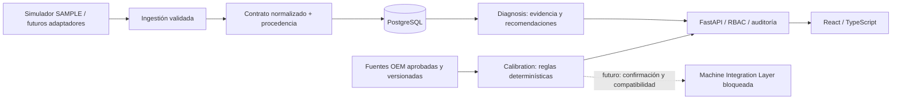

# SSScanner · Arquitectura del MVP

Estado: primera fase, 2026-09-07. Alcance aprobado: arquitectura y esqueleto ejecutable; sin control de máquinas ni inferencia clínica de averías. Nombre de producto: **SSScanner**; se conserva `ssscaner/` como carpeta existente para evitar cambios de rutas externos.

Ampliación solicitada después: botón BETA, guía para inversores, Web Bluetooth de solo lectura con mapa GATT manual y laboratorio ML con MLP/Random Forest entrenados sobre SAMPLE. Documentado en `docs/protocols/BLE.md`, `docs/ml/BETA_LAB.md` y `docs/INVESTOR_DEMO.md`. La implementación no equivale a validación física ni modifica Calibration.

## 1. Diagnóstico del repositorio recibido

- `frontend/`: React 18 + Vite, paneles de escáner, A/C, osciloscopio y red neuronal. Reutilizar lenguaje visual y flujos, no resultados simulados como reales.
- `backend/api/main.py`: API monolítica local con usuarios/tokens en memoria, telemetría sintética y diagnósticos inicialmente aleatorios. Durante la revisión previa al brief se añadió hash de contraseñas, validación y comparación manual en `static/technical.*`. Es un prototipo anterior a esta arquitectura, no el backend del nuevo MVP.
- `backend/services/`: cada servicio aparece dos veces, con guiones y con guiones bajos. El Compose apunta a carpetas con guiones bajos, pero los Dockerfiles/requirements están en las carpetas con guiones. No hay una ruta de despliegue coherente.
- Autenticación heredada importa `HTTPAuthCredentials`, que no es el nombre de la clase de credenciales de FastAPI. El modelo SQLAlchemy de ML usa `metadata`, atributo reservado. Se mantienen fuera del proceso nuevo.
- `static/index.html` y `static/app.js` mezclan la marca automotriz con navegación de logística; el registro oculta el formulario sin autenticar contra la API.
- Gateway y React discrepan en JSON vs query params para algunas operaciones. ML calcula una supuesta confianza promediando magnitudes de unidades diferentes; entrenamiento devuelve precisión fija sin entrenar.
- Escáner heredado hace fallback a dispositivos ficticios ante errores de Bluetooth. Esto no se reutiliza en el MVP.
- README anterior y Dockerfile apuntaban a `apps.api.main:app`, ruta inexistente al recibir el proyecto. No se detectó repositorio Git; no se puede afirmar compatibilidad histórica ni hacer un diff contra un commit.

Los directorios anteriores se conservan como referencia. El punto de entrada nuevo y único es `apps.api.main:app`; la web nueva es `apps/web`. La suite anterior es una auditoría separada, no una garantía del nuevo producto.

## 2. Decisión: monolito modular

React + TypeScript + Vite → FastAPI → PostgreSQL. Un proceso API, módulos Python internos con interfaces explícitas y una base de datos. SQLite está permitido únicamente en desarrollo/pruebas locales. PostgreSQL es el objetivo de despliegue y se configura en `compose.mvp.yml`.

No introducir Redis, TimescaleDB, Kafka, Kubernetes, Django, servicios ML separados ni GPU en esta fase. Añadir Redis al necesitar varios workers/rate limiting distribuido; evaluar TimescaleDB después de medir volumen/retención y patrones de consulta. Migrar módulos a servicios solo con una necesidad operativa demostrada.

## 3. Módulos y responsabilidad

| Módulo | Responsabilidad | Primera fase |
|---|---|---|
| Identity / tenancy | organizaciones, sesiones, roles | Registro local, login, logout, permisos y aislamiento |
| Assets | vehículos, maquinaria y clientes | Alta/lista de vehículos; otras entidades diseñadas |
| Hardware / protocols | adaptar transporte a eventos | Simulador SAMPLE y conector Web Bluetooth numérico de solo lectura, pendiente de validar por modelo |
| Ingestion | validar lote, normalizar, deduplicar | Contrato limitado de señales normalizadas; persistencia por sesión |
| Diagnosis | evaluar calidad y evidencia | Contrato que devuelve SOURCE_REQUIRED; sin precisión inventada |
| Calibration | fuentes y perfiles versionados | Respuesta bloqueada SOURCE_REQUIRED; ninguna carga calculada |
| Maintenance | planes, vencimientos, órdenes | Esquema y API futura, no scheduler |
| ML | datasets, entrenamiento, registro | Laboratorio CPU: MLP y Random Forest, métricas/artefactos SAMPLE; sin inferencia sobre vehículos reales |
| Integration | conectores de estaciones | Interfaz deshabilitada; no hay endpoint de ejecución |
| Audit / reports | autor, recurso y resultado | Auditoría de escritura y exportación de sesión |

## 4. Frontera Diagnosis / Calibration

Diagnosis recibe una sesión de medición; devuelve evidencia, calidad, hipótesis, recomendaciones y versiones de reglas/modelos. Una hipótesis no demuestra la causa. Confianza estadística solo existe si un modelo ha sido validado y calibrado; en esta fase es `null`.

Calibration no importa código de ML. Sus entradas futuras son IDs de vehículo/sistema y una versión aprobada de especificación; nunca acepta masa propuesta por IA. Resolverá identidad exacta (variante, motor, sistema/compresor, revisión), fuente, vigencia, refrigerante, aceite, unidades y tolerancias. Si falta cualquier dato: `SOURCE_REQUIRED`; si contradice la ficha: `REJECTED`. Presión no determina masa de carga.

Perfil futuro: `id, organization_id, vehicle_id, machine_id?, source_version_id, created_at, created_by, version, supersedes_id, previous_values, current_values, validation_method, evidence_ids, status, digest`. Ningún PATCH sustituye versiones aprobadas. Aprobación técnica y revocación son eventos nuevos. El aceite total del sistema no se interpreta automáticamente como cantidad que se debe añadir durante una reparación.

Machine Integration Layer futura debe verificar perfil vigente, hash, compatibilidad explícita de estación/refrigerante, límites OEM y de máquina, capacidades y unidades, confirmación del técnico ligada al hash y expiración. Añadir idempotencia, interlocks, cancelación, estados, timeout y recibo de ejecución. **No existe comando de escritura a hardware en esta fase.**

## 5. Datos, seguridad y operación

- `organization_id` proviene de la sesión autenticada, nunca del body. Consultas de recursos incluyen organización e ID. Un recurso ajeno devuelve 404.
- Roles: admin gestiona miembros/configuración; technician crea equipos, inicia simulaciones e ingesta; viewer lee. En primera fase alta de empresas solo en desarrollo, no registro público de producción.
- Contraseñas con scrypt y sal individual. Tokens opacos aleatorios, solo hash en base de datos, caducidad y revocación. Navegador guarda token solo en memoria. TLS obligatorio en despliegue; cookies HttpOnly/CSRF o IdP será la siguiente evolución de sesión.
- Límite de peticiones por IP, de un solo proceso; body acotado, listas y strings limitados, números finitos, timestamps con zona, unidades enumeradas. No confiar en X-Forwarded-For sin proxy configurado.
- Auditoría en la misma transacción de cambios: actor, empresa, acción, recurso, fecha y request ID. No registrar tokens, contraseñas ni payloads completos de autenticación. Las garantías anti-manipulación requieren almacenamiento separado en producción.
- Sesiones de captura almacenan origen SAMPLE explícito. No se aceptan eventos simulados como hardware real. Datos reales y SAMPLE jamás comparten un dataset de entrenamiento por defecto.
- PostgreSQL: base con usuario restringido; usar RLS como defensa adicional antes de SaaS multiempresa, no considerarla implementada por tener un filtro ORM. Política de contexto por transacción y rol sin BYPASSRLS; probar jobs y backups por separado.
- Backup: pg_dump consistente, cifrado fuera del host, retención definida y ensayo periódico de restauración. Esta fase incluye instrucciones; no existe un backup automatizado instalado en el equipo.

## 6. Protocolos y simulación

Ver `docs/protocols/SIMULATION.md`. Primera fase simula señales normalizadas y metadatos del protocolo seleccionado, **no emula eléctricamente un bus ni demuestra compatibilidad SAE**. OBD-II/J1939 requieren catálogos autorizados y fixtures trazables. Sin DBC/DA o documentación del fabricante, señal = `SOURCE_REQUIRED`.

## 7. Evolución de IA

1. Reglas versionadas: calidad, unidades, referencias aplicables y trazabilidad; evaluar sensibilidad/especificidad con casos revisados.
2. Estadística: detectar cambios por sensor/condición operativa; no confundir una anomalía con una avería.
3. ML supervisado: datos etiquetados por reparación confirmada, split por equipo/tiempo/taller para evitar fuga de información.
4. Redes neuronales solo cuando superen una línea base bajo el mismo protocolo y su coste se justifique.
5. Predicción: definición de horizonte/evento, datos censurados, evaluación temporal, calibración de probabilidad y deriva.

Pipeline: raw inmutable → validación/cuarentena → normalización versionada → características → almacenamiento → snapshot de dataset → entrenamiento offline → validación independiente → registro con métricas/linaje → aprobación → inferencia en sombra → despliegue/reversión. Ninguna fase otorga a ML permiso para modificar una especificación OEM.

## 8. Riesgos y puertas de avance

| Riesgo | Mitigación / condición de avance |
|---|---|
| Falta de especificaciones OEM/licencias | Sin perfil validado hasta tener fuente, revisión y aplicabilidad verificadas |
| R134a/R1234yf o aceite incompatibles | Identificación explícita; no inferir por presión ni modelo aproximado |
| Unidades, presión absoluta/manométrica, sensores descalibrados | Contratos y metadatos por canal; bloquear derivadas sin referencia |
| Superheat/subcooling inaplicables | Requerir arquitectura A/C, posición de sensores y datos termodinámicos validados; no calcular ahora |
| Señales correlacionadas parecen averías | Reglas contextualizadas; sin porcentajes heurísticos presentados como probabilidad |
| Multitenancy | Filtros, FK compuestas, pruebas de fuga; RLS antes de entorno multiempresa real |
| CAN propietario / bus pesado saturado | Fase inicial listen-only; drivers y velocidades verificadas, presupuesto de bus |
| PCB: tensión, transitorios, aislamiento, EMC | Revisión eléctrica independiente antes de prototipo conectado; no se diseña PCB final |
| OTA y búfer offline | Actualización firmada, rollback, secuencias y deduplicación; diseño posterior |
| Infra heredada inconsistente | Entrada nueva aislada; migración por módulo con pruebas; no desplegar Compose heredado |

## 9. Fuentes verificadas

- [FastAPI: aplicaciones por módulos](https://fastapi.tiangolo.com/tutorial/bigger-applications/): APIRouter y dependencias compartidas.
- [PostgreSQL: Row Security](https://www.postgresql.org/docs/18/ddl-rowsecurity.html): políticas por fila y límites según el rol.
- [SAE J1939, documento de nivel superior](https://saemobilus.sae.org/standards/j1939_201308-serial-control-communications-heavy-duty-vehicle-network-top-level-document): asignaciones PGN/SPN en Digital Annex. No se han adquirido ni incorporado tablas propietarias.
- [Vite: requisitos del entorno](https://vite.dev/guide/): versión de Node compatible.

Las decisiones de arquitectura son propuestas para este proyecto, no especificaciones oficiales del vehículo.
